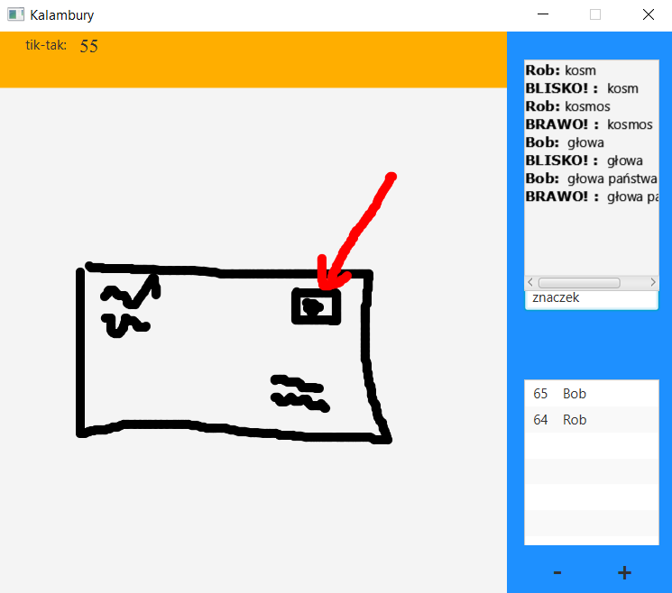
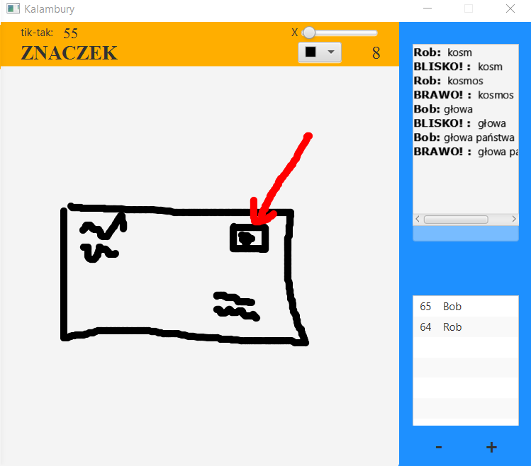

# Charades
 
Simple charades game for two or more playes, with more than 3000 different charade words and it can by easily expanded upon in the words.txt file

## Screenshots

Guesser             |  Drawer
:-------------------------:|:-------------------------:
  |  


## Installing

After cloning this repository, change into the newly created directory and run

```
gradlew build
```

## Running the Application (locally)
Firstly you need to run server using `gradlew startServer`

After running `gradlew shadowJar` the resulting JAR file is located in directory `build/libs`.\
Now you can run game clients by: 

```
java -jar build/libs/kalambury-1.0.jar
```

*Java 1.11 is expected to be installed on our system.*

## Features

* scoreboard and players names
* close guesses
* timer
* resizing window with + and -
* different colors and sizes of brush
* screen cleaning
* and more
